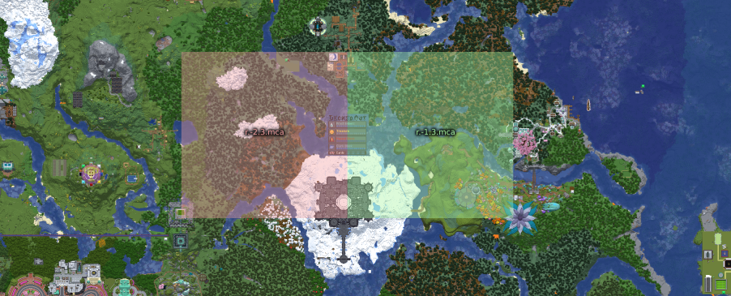

# Decked Out 2 Files
Clean region and entities files with basic maintenance and a couple minor fixes for TangoTek's Decked Out 2 from HermitCraft Season 9. This repository is strictly to make starting the dungeon from scratch easier without reloading the entire save. The specific fixes were made for ambiance reasons only and do not affect gameplay.

If you find something that was missed, create an issue so I can look into it.

Quicklinks:
- [Files](#files)
- [Folders](#folders)
- [Instructions](#instructions)
- [Changes](#changes)
- [Warnings](#warnings)

# Files

`r.-1.3.mca`: Affects the Eastern half of Decked Out. Item shop and area below.

`r.-2.3.mca`: Affects the Western half of Decked Out. Difficulty selector and area below.

# Folders

[`region_files`](region_files): Files for resetting droppers and structure changes

[`entities_files`](entities_files): Files for resetting mobs, item frames, and armor stands

# Instructions

If you have started playing Decked Out, ensure that you have your deck in your inventory before continuing. Failure to do so can result in a lost deck. Making a save backup is also recommended.

## Full Reset
1. Ensure that the world save is not currently open in game.
2. Navigate to your save's folder and open the `region`` folder.
3. _**(optional)**_ Rename `r.-1.3.mca` to `r.-1.3.mca.old`. This will be for a backup if something goes wrong.
4. Copy the `r.-1.3.mca` file from the [`region_files`](region_files) folder to the save's region folder.
5. _**(optional)**_ Rename `r.-1.3.mca` to `r.-2.3.mca.old`. This will be for a backup if something goes wrong.
6. Copy the `r.-2.3.mca` file from the [`region_files`](region_files) folder to the save's region folder.
7. Navigate up a folder and open the save's `entities` folder.
8. _**(optional)**_ Rename `r.-1.3.mca` to `r.-1.3.mca.old`. This will be for a backup if something goes wrong.
9. Copy the `r.-1.3.mca` file from the [`entities_files`](entities_files) folder to the save's region folder.
10. _**(optional)**_ Rename `r.-1.3.mca` to `r.-2.3.mca.old`. This will be for a backup if something goes wrong.
11. Copy the `r.-2.3.mca` file from the [`entities_files`](entities_files) folder to the save's region folder.

## Non-entity Reset (dungeon structure damage, droppers empty, redstone broken, etc.)
1. Ensure that the world save is not currently open in game.
2. Navigate to your save's folder and open the `region`` folder.
3. _**(optional)**_ Rename `r.-1.3.mca` to `r.-1.3.mca.old`. This will be for a backup if something goes wrong.
4. Copy the `r.-1.3.mca` file from the [`region_files`](region_files) folder to the save's region folder.
5. _**(optional)**_ Rename `r.-1.3.mca` to `r.-2.3.mca.old`. This will be for a backup if something goes wrong.
6. Copy the `r.-2.3.mca` file from the [`region_files`](region_files) folder to the save's region folder.

## Entity Reset (hopper carts, item frames, mobs, armor stands, etc.)
1. Ensure that the world save is not currently open in game.
2. Navigate to your save's folder and open the `region`` folder.
3. _**(optional)**_ Rename `r.-1.3.mca` to `r.-1.3.mca.old`. This will be for a backup if something goes wrong.
4. Copy the `r.-1.3.mca` file from the [`entities_files`](entities_files) folder to the save's region folder.
5. _**(optional)**_ Rename `r.-1.3.mca` to `r.-2.3.mca.old`. This will be for a backup if something goes wrong.
6. Copy the `r.-2.3.mca` file from the [`entities_files`](entities_files) folder to the save's region folder.

# Changes

## Infrastructure Changes

- Maintenance Changes
    - Refilled Suit Up armor droppers
        - Shulker boxes have been placed nearby for easy refills in creative mode
    - Refilled Porkchop Power dropper
    - Refilled Info Map dropper
    - Refilled Difficulty Selector droppers
    - Refilled Compass Droppers
    - Cleared Lost games barrel and refilled adjacent dropper
    - Cleared Crown Shop barrels
    - Refilled Crown Shop items
    - Filled Cleo's leftover shards barrel to max
    - Refilled Ember Shop
    - Cleared Embers from Ember Shop barrels
    - Refilled Artifakes droppers
        - Some Artifakes are not like the others, they have been placed in a nearby chest
    - Cleared previously collected Artifacts from Ember conversion system
    - Refilled Artifact to Ember conversion system with Embers
        - A channel has cut out above and hoppers added to be able to easily refill the system
        - A Shulker box has been placed nearby for easy refills in creative mode

## Level Changes

### Level 1

- Maintenance Changes
    - Cleared compasses (and other items) from artifact spots
    - Refilled Treasure and Ember droppers
    - Cleared Caves of Carnage key chest

- Fixes
    - Connected Artifact spot #10 to system so that the artifact found sound will play

### Level 2

- Maintenance Changes
    - Cleared compasses (and other items) from artifact spots
    - Refilled Treasure and Ember droppers
    - Refilled Rusty dropper
    - Cleared The Black Mines key chest

### Level 3

- Maintenance Changes
    - Cleared compasses (and other items) from artifact spots
    - Refilled Treasure and Ember droppers
    - Refilled TNT dispenser
    - Cleared The Burning Dark key chest

- Issue not fixed
    - There are droppers on the middle level that do not have note blocks to indicate something was dropped. This is due to ceiling design and close proximity to the top level's hall (1 block above the droppers). Fixing this would require a major redstone or change to the positioning of the droppers and is outside this project's scope.

### Level 4

- Maintenance Changes
    - Cleared compasses (and other items) from artifact spots
    - Secret Treasure and Ember dropper
    - Refilled TNT dispenser

## Structure Changes

- Closed holes in lobby and Levels 1-3
- Hid entrance to redstone in starting room after exiting minecart
    - 2 blocks of Powdered Snow are now blocking the path on the right side

# Warnings

## Existing Decked Out Changes Lost
Copying the files from this repository to your save will overwrite any changes made to Decked Out. If you have played and created a deck, make sure the deck is in your inventory before replacing the files. Failure to do so will result in a lost deck if it is stored in the affected areas.

## Avoiding Crashes
Files should be replaced after the save has been closed. The game can remain open on the starting menu, but the save must be closed.

## Adjacent Builds Affected
Replacing the files will affect builds near Decked Out. The affected builds are as follows:

- **r.-1.3.mca:** Soup Group (PearlescentMoon and GeminiTay) and xBCrafted
- **r.-2.3.mca:** Mumbo Jumbo and xBCrafted

# Special Thanks

- TangoTek for creating Decked Out 2
- All Hermits for doing Hermitecraft
- [u/Pyrosorc](https://www.reddit.com/user/Pyrosorc) and [u/Kienlabadao](https://www.reddit.com/user/Kienlabadao) for point out issues that needed to be addressed
- [u/CBYrdt](https://www.reddit.com/user/CBYrdt) for pointing out the need for both region and entities files